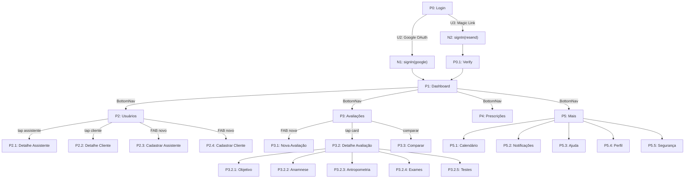

# Breadboard — Fitness System Mobile

> Mapa completo de affordances e wiring do sistema.
> Gerado a partir do PRD (itens 1–21) + estrutura de código existente.
> **Ground truth:** código em `app/` e `components/`. Este documento reflete o que IS e o que foi especificado no PRD mas ainda não implementado (marcado com `[TODO]`).

---

## Places

| # | Place | Rota | Descrição |
|---|-------|------|-----------|
| P0 | Login | `/login` | Entrada pública — autenticação |
| P0.1 | Verify | `/login/verify` | Confirmação de magic link |
| P1 | Dashboard (Profissional) | `/app` | Visão gerencial: KPIs, gráficos, atalhos |
| P1b | Dashboard (Assistente) | `/app` | Visão operacional: vínculo com responsável |
| P2 | Usuários | `/app/usuarios` | Hub com tabs: Assistentes \| Clientes |
| P2.1 | Detalhe Assistente | `/app/usuarios/assistentes/[id]` | Tabs: Informações, Acesso, Permissões, Avaliações, Prescrições |
| P2.2 | Detalhe Cliente | `/app/usuarios/clientes/[id]` | Tabs: Informações, Acesso, Avaliações, Prescrições |
| P2.3 | Cadastrar Assistente | `/app/usuarios/assistentes/novo` | Stepper 3 etapas |
| P2.4 | Cadastrar Cliente | `/app/usuarios/clientes/novo` | Stepper 4 etapas |
| P3 | Avaliações | `/app/avaliacoes` | Listagem filtrável por cards |
| P3.1 | Nova Avaliação | `/app/avaliacoes/nova` | Seleção: cliente, população, modalidade |
| P3.2 | Detalhe Avaliação | `/app/avaliacoes/[id]` | Header persistente + subnavegação por módulos |
| P3.2.1 | Objetivo e Disponibilidade | `/app/avaliacoes/[id]/objetivo` | Sliders de objetivo + switches de disponibilidade |
| P3.2.2 | Anamnese (hub) | `/app/avaliacoes/[id]/anamnese` | Sub-itens com status de conclusão |
| P3.2.2.1 | Parâmetros Basais | `/app/avaliacoes/[id]/anamnese/parametros-basais` | Sinais vitais + classificação clínica via API |
| P3.2.2.2 | PAR-Q+ | `[TODO]` | Stepper de triagem de prontidão |
| P3.2.2.3 | Risco Coronariano | `[TODO]` | Inputs + card de classificação via API |
| P3.2.2.4 | Framingham | `[TODO]` | Cálculo automático por idade/gênero |
| P3.2.2.5 | Questionário Avançado | `[TODO]` | Perguntas Sim/Não com campo de observação |
| P3.2.2.6 | Questionário Completo | `[TODO]` | Stepper 9 etapas |
| P3.2.3 | Antropometria (hub) | `/app/avaliacoes/[id]/antropometria` | Sub-módulos com tabs ou navegação sequencial |
| P3.2.3.1 | Perímetros | `[TODO]` | Medidas corporais + cálculo de simetria |
| P3.2.3.2 | Diâmetros | `[TODO]` | Medidas ósseas/estruturais |
| P3.2.3.3 | Peso e Estatura | `[TODO]` | IMC, ICQ, estados incompletos |
| P3.2.3.4 | Composição Corporal | `[TODO]` | Protocolo + dobras + resultado via API |
| P3.2.3.5 | Somatotipo | `[TODO]` | Resultado via API — somente leitura |
| P3.2.4 | Exames Clínicos | `/app/avaliacoes/[id]/exames` | Cardíaco, Hemograma, Postural, Outros |
| P3.2.5 | Testes | `/app/avaliacoes/[id]/testes` | VO₂ Preditivo + VO₂ Máx. |
| P3.3 | Comparar Avaliações | `[TODO]` | Até 3 avaliações lado a lado |
| P4 | Prescrições | `/app/prescricoes` | Listagem: Minhas + Todas |
| P4.1 | Detalhe Prescrição | `/app/prescricoes/[id]` | Ficha de treino + aeróbicos |
| P5 | Mais (hub) | `/app/mais` | Acesso a Calendário, Notificações, Ajuda, Perfil |
| P5.1 | Calendário | `/app/mais/calendario` | Visão dia/semana/mês |
| P5.1.1 | Novo Agendamento | `/app/mais/calendario/novo` | Formulário de agendamento |
| P5.2 | Notificações | `/app/mais/notificacoes` | Lista cronológica com lido/não lido |
| P5.3 | Ajuda | `/app/mais/ajuda` | FAQ + suporte |
| P5.4 | Perfil | `/app/mais/perfil` | Foto, dados pessoais, endereço, dados profissionais |
| P5.5 | Segurança | `/app/mais/seguranca` | Alterar senha |
| P5.6 | Billing | `/app/settings/billing` | Upgrade de plano via Stripe |
| PB | Backend | `app/api/*` | Handlers de API — Next.js Route Handlers |

---

## UI Affordances

### P0 — Login

| # | Affordance | Controle | Wires Out |
|---|-----------|----------|-----------|
| U1 | Campo e-mail | input[type=email] | — |
| U2 | Botão "Continuar com Google" | click | → N1 |
| U3 | Botão "Entrar com Magic Link" | click | → N2 |
| U4 | Link "Termos / Privacidade" | click | → externo |

### P0.1 — Verify

| # | Affordance | Controle | Wires Out |
|---|-----------|----------|-----------|
| U5 | Mensagem de confirmação | display | ← N2 |
| U6 | Link "Reenviar e-mail" | click | → N2 |

### P1 — Dashboard (Profissional)

| # | Affordance | Controle | Wires Out |
|---|-----------|----------|-----------|
| U10 | KPI — Total de clientes | display | ← N10 |
| U11 | KPI — Clientes ativos/inativos | display | ← N10 |
| U12 | KPI — Total de assistentes | display | ← N10 |
| U13 | KPI — Avaliações (total / 30 dias) | display | ← N10 |
| U14 | KPI — Prescrições (total / 30 dias) | display | ← N10 |
| U15 | Gráfico temporal — Avaliações | display | ← N10 |
| U16 | Gráfico temporal — Prescrições | display | ← N10 |
| U17 | Atalho "Ver clientes" | click | → P2 (aba Clientes) |
| U18 | Atalho "Ver avaliações" | click | → P3 |
| U19 | Atalho "Ver prescrições" | click | → P4 |
| U20 | Atalho "Novo agendamento" | click | → P5.1.1 |
| U21 | Trial banner (se TRIAL) | display | → P5.6 |

### P1b — Dashboard (Assistente)

| # | Affordance | Controle | Wires Out |
|---|-----------|----------|-----------|
| U25 | Card do profissional responsável | display | ← N11 |
| U26 | Dados do assistente | display | ← N11 |
| U27 | KPIs operacionais | display | ← N11 |
| U28 | Atalhos rápidos (clientes, avaliações, prescrições) | click | → P2 / P3 / P4 |

### P2 — Usuários

| # | Affordance | Controle | Wires Out |
|---|-----------|----------|-----------|
| U30 | Tab "Assistentes" | click | → [lista assistentes] |
| U31 | Tab "Clientes" | click | → [lista clientes] |
| U32 | Card de assistente | tap | → P2.1 |
| U33 | Card de cliente | tap | → P2.2 |
| U34 | Ícone excluir assistente | tap | → P_ConfirmDelete |
| U35 | Ícone excluir cliente | tap | → P_ConfirmDelete |
| U36 | FAB / CTA "Novo assistente" | tap | → P2.3 |
| U37 | FAB / CTA "Novo cliente" | tap | → P2.4 |
| U38 | Chip de status (ativo/inativo) | tap | → N20 |

### P2.1 — Detalhe Assistente

| # | Affordance | Controle | Wires Out |
|---|-----------|----------|-----------|
| U40 | Header: foto / nome / métricas | display | ← N21 |
| U41 | Tab "Informações" | tap | → [dados pessoais + endereço + profissional] |
| U42 | Tab "Acesso" | tap | → [e-mail, status, credenciais] |
| U43 | Tab "Permissões" | tap | → [lista de permissões] |
| U44 | Tab "Avaliações" | tap | → [lista avaliações vinculadas] |
| U45 | Tab "Prescrições" | tap | → [lista prescrições vinculadas] |
| U46 | Botão "Editar" | tap | → P2.1 (Edit Mode) |

### P2.2 — Detalhe Cliente

| # | Affordance | Controle | Wires Out |
|---|-----------|----------|-----------|
| U50 | Header: foto / nome / dados | display | ← N22 |
| U51 | Tab "Informações" | tap | → [dados pessoais] |
| U52 | Tab "Acesso" | tap | → [e-mail, status] |
| U53 | Tab "Avaliações" | tap | → [lista avaliações] |
| U54 | Tab "Prescrições" | tap | → [lista prescrições] |
| U55 | Botão "Editar" | tap | → P2.2 (Edit Mode) |
| U56 | CTA "Nova avaliação" | tap | → P3.1 (pré-selecionado com cliente) |

### P2.3 — Cadastrar Assistente (Stepper)

| # | Affordance | Controle | Wires Out |
|---|-----------|----------|-----------|
| U60 | Stepper — Etapa 1: Dados pessoais | form | — |
| U61 | Upload de foto (recorte/zoom) | tap | → N23 |
| U62 | Stepper — Etapa 2: Endereço | form | — |
| U63 | Input CEP → autopreenchimento | blur | → N24 |
| U64 | Stepper — Etapa 3: Permissões e acesso | form | — |
| U65 | Gerar senha segura | tap | → N25 |
| U66 | Copiar login + senha | tap | → clipboard |
| U67 | Botão "Salvar assistente" | tap | → N26 |

### P2.4 — Cadastrar Cliente (Stepper)

| # | Affordance | Controle | Wires Out |
|---|-----------|----------|-----------|
| U70 | Stepper — Etapa 1: Dados pessoais | form | — |
| U71 | Stepper — Etapa 2: Endereço e profissão | form | — |
| U72 | Input CEP → autopreenchimento | blur | → N24 |
| U73 | Stepper — Etapa 3: Responsável e emergência | form | — |
| U74 | Stepper — Etapa 4: Acesso | form | — |
| U75 | Gerar senha segura | tap | → N25 |
| U76 | Botão "Salvar cliente" | tap | → N27 |

### P3 — Avaliações (Listagem)

| # | Affordance | Controle | Wires Out |
|---|-----------|----------|-----------|
| U80 | Card de avaliação | tap | → P3.2 |
| U81 | Filtros: cliente / data / população / responsável | select/chip | → N30 |
| U82 | Ação "Comparar" | tap | → P3.3 |
| U83 | Ação "Gerar PDF" | tap | → N31 |
| U84 | Ação "Excluir" | tap | → P_ConfirmDelete → N32 |
| U85 | FAB "Nova avaliação" | tap | → P3.1 |

### P3.1 — Nova Avaliação

| # | Affordance | Controle | Wires Out |
|---|-----------|----------|-----------|
| U90 | Select "Cliente" | select | — |
| U91 | Select "População" | select | — |
| U92 | Select "Modalidade" | select | — |
| U93 | Toggle "Agendar próxima" | switch | → P5.1.1 (pré-preenchido) |
| U94 | Botão "Criar avaliação" | tap | → N33 |

### P3.2 — Detalhe Avaliação

| # | Affordance | Controle | Wires Out |
|---|-----------|----------|-----------|
| U100 | Header persistente (cliente + data + status) | display | ← N34 |
| U101 | Nav "1. Objetivo" | tap | → P3.2.1 |
| U102 | Nav "2. Anamnese" | tap | → P3.2.2 |
| U103 | Nav "3. Antropometria" | tap | → P3.2.3 |
| U104 | Nav "4. Exames Clínicos" | tap | → P3.2.4 |
| U105 | Nav "5. Testes" | tap | → P3.2.5 |
| U106 | Ação "Gerar PDF" | tap | → N31 |
| U107 | Ação "Comparar" | tap | → P3.3 |

### P3.2.1 — Objetivo e Disponibilidade

| # | Affordance | Controle | Wires Out |
|---|-----------|----------|-----------|
| U110 | Sliders de objetivos (0–4 por item) | drag | — |
| U111 | Switch por dia da semana | toggle | → [expansão inline] |
| U112 | Select de duração (15min–2h) | select | — |
| U113 | Botão "Salvar" | tap | → N35 |

### P3.2.2 — Anamnese (Hub)

| # | Affordance | Controle | Wires Out |
|---|-----------|----------|-----------|
| U120 | Card "Parâmetros Basais" + status | tap | → P3.2.2.1 |
| U121 | Card "PAR-Q+" + status | tap | → P3.2.2.2 |
| U122 | Card "Risco Coronariano" + status | tap | → P3.2.2.3 |
| U123 | Card "Framingham" + status | tap | → P3.2.2.4 |
| U124 | Card "Questionário Avançado" + status | tap | → P3.2.2.5 |
| U125 | Card "Questionário Completo" + status | tap | → P3.2.2.6 |

### P3.2.2.1 — Parâmetros Basais

| # | Affordance | Controle | Wires Out |
|---|-----------|----------|-----------|
| U130 | Imagem corporal com indicadores | display | ← N36 |
| U131 | Card por parâmetro (pressão, FC, temp, sat, glicemia) | display | ← N36 |
| U132 | Badge de status clínico por parâmetro | display | ← N36 |
| U133 | Info icon → bottom sheet explicativo | tap | → P_InfoSheet |
| U134 | Botão "Editar valores" | tap | → P_EditBasal |
| U135 | Inputs: sistólica / diastólica / glicemia / temp / FC / sat | form | — |
| U136 | Botão "Salvar" | tap | → N37 |

### P3.2.3 — Antropometria (Hub)

| # | Affordance | Controle | Wires Out |
|---|-----------|----------|-----------|
| U140 | Card "Perímetros" | tap | → P3.2.3.1 |
| U141 | Card "Diâmetros" | tap | → P3.2.3.2 |
| U142 | Card "Peso e Estatura" | tap | → P3.2.3.3 |
| U143 | Card "Composição Corporal" | tap | → P3.2.3.4 |
| U144 | Card "Somatotipo" | tap | → P3.2.3.5 |

### P3.2.4 — Exames Clínicos

| # | Affordance | Controle | Wires Out |
|---|-----------|----------|-----------|
| U150 | Seção "Exame Cardíaco" | form | → N40 |
| U151 | Seção "Hemograma Completo" | form | → N40 |
| U152 | Seção "Exame Postural" | form | — |
| U153 | Ferramentas de anotação sobre imagem postural | tap/draw | — |
| U154 | Seção "Outros Exames" | form | → N40 |
| U155 | Upload de arquivo (PDF/PNG/JPEG) | tap | → N41 |
| U156 | Botão "Salvar" | tap | → N40 |

### P3.2.5 — Testes

| # | Affordance | Controle | Wires Out |
|---|-----------|----------|-----------|
| U160 | Select "Nível de atividade física" | select | — |
| U161 | KPI — METs preditivos | display | ← N42 |
| U162 | KPI — Consumo calórico preditivo | display | ← N42 |
| U163 | Gráfico VO₂ preditivo | display | ← N42 |
| U164 | Gráfico FC preditiva (faixa por idade) | display | ← N42 |
| U165 | Estado incompleto + CTA "Editar peso/estatura" | display/tap | → P3.2.3.3 |
| U166 | Botão "Salvar" | tap | → N43 |

### P3.3 — Comparar Avaliações

| # | Affordance | Controle | Wires Out |
|---|-----------|----------|-----------|
| U170 | Seleção de até 3 avaliações | checkbox | — |
| U171 | Botão "Comparar" | tap | → N44 |
| U172 | Seções expansíveis por parâmetro | accordion | — |
| U173 | Exibição: valor por data + delta absoluto + delta % | display | ← N44 |

### P4 — Prescrições

| # | Affordance | Controle | Wires Out |
|---|-----------|----------|-----------|
| U180 | Tab "Minhas prescrições" | tap | — |
| U181 | Tab "Todas as prescrições" | tap | — |
| U182 | Card de prescrição | tap | → P4.1 |
| U183 | Filtros | select | → N50 |

### P4.1 — Detalhe Prescrição

| # | Affordance | Controle | Wires Out |
|---|-----------|----------|-----------|
| U190 | Ficha de treino (exercícios + parâmetros) | display | ← N51 |
| U191 | Seção Aeróbicos | display | ← N51 |
| U192 | Botão "Gerar PDF" | tap | → N52 |

### P5 — Mais (Hub)

| # | Affordance | Controle | Wires Out |
|---|-----------|----------|-----------|
| U200 | Item "Calendário" | tap | → P5.1 |
| U201 | Item "Notificações" | tap | → P5.2 |
| U202 | Item "Ajuda" | tap | → P5.3 |
| U203 | Item "Meu Perfil" | tap | → P5.4 |
| U204 | Item "Segurança" | tap | → P5.5 |
| U205 | Item "Plano / Billing" | tap | → P5.6 |
| U206 | Botão "Sair" | tap | → N60 |

### P5.1 — Calendário

| # | Affordance | Controle | Wires Out |
|---|-----------|----------|-----------|
| U210 | Toggle dia / semana / mês | tap | — |
| U211 | Atalho "Hoje" | tap | — |
| U212 | Card de evento | tap | → P_EventSheet |
| U213 | FAB "Novo agendamento" | tap | → P5.1.1 |

### P5.1.1 — Novo Agendamento

| # | Affordance | Controle | Wires Out |
|---|-----------|----------|-----------|
| U220 | Select tipo (avaliação/prescrição) | select | — |
| U221 | Input título | input | — |
| U222 | Select cliente | select | — |
| U223 | Select responsável | select | — |
| U224 | Date/time pickers | tap | — |
| U225 | Textarea descrição | input | — |
| U226 | Botão "Salvar agendamento" | tap | → N61 |

### P5.4 — Perfil

| # | Affordance | Controle | Wires Out |
|---|-----------|----------|-----------|
| U230 | Foto com CTA editar (recorte/zoom) | tap | → N62 |
| U231 | Formulário dados pessoais | form | — |
| U232 | Formulário endereço | form | — |
| U233 | Input CEP → autopreenchimento | blur | → N24 |
| U234 | Formulário dados profissionais | form | — |
| U235 | Botão "Salvar" | tap | → N63 |

### P5.5 — Segurança

| # | Affordance | Controle | Wires Out |
|---|-----------|----------|-----------|
| U240 | Input senha atual | input | — |
| U241 | Input nova senha | input | — |
| U242 | Input confirmar nova senha | input | — |
| U243 | Botão "Salvar nova senha" | tap | → N64 |

---

## Code Affordances (API + lógica)

### Autenticação

| # | Affordance | Returns To | Descrição |
|---|-----------|-----------|-----------|
| N1 | `signIn("google")` | → P0 / → P1 | Inicia OAuth Google via Auth.js |
| N2 | `signIn("resend", { email })` | → P0.1 | Envia magic link via Resend |
| N3 | `signOut()` | → P0 | Encerra sessão |
| N60 | `signOut()` | → P0 | Alias de N3 via menu Mais |

### Dashboard

| # | Affordance | Returns To | Descrição |
|---|-----------|-----------|-----------|
| N10 | `GET /api/dashboard` `[TODO]` | → U10–U16 | Busca KPIs: clientes, assistentes, avaliações, prescrições |
| N11 | `GET /api/dashboard/assistant` `[TODO]` | → U25–U27 | Busca dados do responsável + KPIs do assistente |

### Usuários

| # | Affordance | Returns To | Descrição |
|---|-----------|-----------|-----------|
| N20 | `PATCH /api/assistants/[id]` `{ status }` | → U38 | Altera status ativo/inativo |
| N21 | `GET /api/assistants/[id]` | → U40 | Busca detalhe do assistente |
| N22 | `GET /api/clients/[id]` `[TODO]` | → U50 | Busca detalhe do cliente |
| N23 | Upload de foto → `POST /api/upload` `[TODO]` | → U61 | Processa e salva imagem recortada |
| N24 | `GET https://viacep.com.br/ws/[cep]/json/` | → U63/U72/U233 | Autopreenchimento de endereço via CEP |
| N25 | `generateSecurePassword()` (client-side) | → U65/U75 | Gera senha aleatória forte |
| N26 | `POST /api/assistants` | → P2 | Cria novo assistente |
| N27 | `POST /api/clients` | → P2 | Cria novo cliente |
| N28 | `DELETE /api/assistants/[id]` | → P2 | Exclui assistente |
| N29 | `DELETE /api/clients/[id]` `[TODO]` | → P2 | Exclui cliente |

### Avaliações

| # | Affordance | Returns To | Descrição |
|---|-----------|-----------|-----------|
| N30 | `GET /api/assessments?filters` | → U80 | Busca avaliações com filtros |
| N31 | `POST /api/assessments/[id]/pdf` `[TODO]` | → download | Gera relatório PDF das seções selecionadas |
| N32 | `DELETE /api/assessments/[id]` `[TODO]` | → P3 | Exclui avaliação |
| N33 | `POST /api/assessments` | → P3.2 | Cria nova avaliação |
| N34 | `GET /api/assessments/[id]` | → U100 | Busca dados do cabeçalho da avaliação |
| N35 | `PUT /api/assessments/[id]/objective` | → P3.2.1 | Salva objetivo e disponibilidade |
| N36 | `GET /api/assessments/[id]/anamnesis` | → U130–U132 | Busca parâmetros basais + classificações clínicas |
| N37 | `PUT /api/assessments/[id]/anamnesis` | → P3.2.2.1 | Salva parâmetros basais |
| N38 | `PUT /api/assessments/[id]/anamnesis` `[TODO: parq]` | → P3.2.2.2 | Salva PAR-Q+ |
| N39 | `PUT /api/assessments/[id]/anamnesis` `[TODO: coronary]` | → P3.2.2.3 | Salva risco coronariano |
| N40 | `PUT /api/assessments/[id]/exams` `[TODO]` | → P3.2.4 | Salva exames clínicos |
| N41 | `POST /api/assessments/[id]/attachments` `[TODO]` | → U155 | Upload de arquivo de exame |
| N42 | `GET /api/assessments/[id]/vo2` `[TODO]` | → U161–U164 | Calcula VO₂ preditivo + faixa de FC por idade |
| N43 | `PUT /api/assessments/[id]/tests` `[TODO]` | → P3.2.5 | Salva dados de testes |
| N44 | `POST /api/assessments/compare` `[TODO]` | → U172–U173 | Compara até 3 avaliações |

### Prescrições

| # | Affordance | Returns To | Descrição |
|---|-----------|-----------|-----------|
| N50 | `GET /api/prescriptions?filters` `[TODO]` | → U182 | Busca prescrições com filtros |
| N51 | `GET /api/prescriptions/[id]` `[TODO]` | → U190–U191 | Busca detalhe da prescrição |
| N52 | `POST /api/prescriptions/[id]/pdf` `[TODO]` | → download | Gera PDF da prescrição |

### Calendário

| # | Affordance | Returns To | Descrição |
|---|-----------|-----------|-----------|
| N61 | `POST /api/calendar` | → P5.1 | Cria novo agendamento |
| N61b | `GET /api/calendar` | → U212 | Busca eventos do período |

### Perfil e Segurança

| # | Affordance | Returns To | Descrição |
|---|-----------|-----------|-----------|
| N62 | `PATCH /api/profile` `{ photo }` | → U230 | Atualiza foto de perfil |
| N63 | `PATCH /api/profile` | → P5.4 | Salva dados do perfil |
| N64 | `PATCH /api/profile` `{ currentPassword, newPassword }` `[TODO]` | → P5.5 | Altera senha |

### Stripe / Billing

| # | Affordance | Returns To | Descrição |
|---|-----------|-----------|-----------|
| N70 | `POST /api/checkout` | → Stripe Checkout | Inicia assinatura PRO |
| N71 | `POST /api/billing-portal` | → Stripe Portal | Gerencia assinatura existente |
| N72 | `POST /api/stripe/webhook` | → DB | Processa eventos Stripe (pagamento, cancelamento) |

### Paywall

| # | Affordance | Returns To | Descrição |
|---|-----------|-----------|-----------|
| N80 | `checkSubscription(user)` | → PaywallGate | Verifica plano e limites antes de renderizar |
| N81 | `checkTrialExpiry(user)` | → TrialBanner | Calcula dias restantes do trial |

---

## Data Stores

| # | Store | Onde é lido | Descrição |
|---|-------|------------|-----------|
| S1 | `session` (Auth.js cookie) | `proxy.ts`, N80 | Sessão do usuário autenticado |
| S2 | `User` (Prisma) | N10, N11, N63 | Dados do usuário: plano, role, trialEndsAt |
| S3 | `Professional` (Prisma) | N10, N21, N63 | Dados do profissional |
| S4 | `Assistant` (Prisma) | N20, N21, N26 | Dados do assistente |
| S5 | `Client` (Prisma) | N22, N27, N29 | Dados do cliente |
| S6 | `Assessment` (Prisma) | N30–N44 | Avaliação e todos os sub-módulos |
| S7 | `CalendarEvent` (Prisma) | N61, N61b | Agendamentos |
| S8 | `Prescription` (Prisma) | N50–N52 | Prescrições |
| S9 | `tokens.ts` (design-system) | globals.css, componentes | Single source of truth de design tokens |
| S10 | `.env.local` | lib/auth, lib/db, lib/stripe | Credenciais e configuração do app |

---

## Mermaid — Navegação Principal

---

## Gaps e TODOs identificados

### APIs ausentes (precisam ser criadas)
- `GET /api/dashboard` — KPIs do profissional
- `GET /api/clients/[id]` — detalhe do cliente
- `DELETE /api/clients/[id]` — exclusão de cliente
- `DELETE /api/assessments/[id]` — exclusão de avaliação
- `POST /api/assessments/[id]/pdf` — geração de PDF
- `POST /api/assessments/compare` — comparação
- `PUT /api/assessments/[id]/anamnesis` (parq, coronary, framingham, advanced, complete)
- `PUT /api/assessments/[id]/anthropometry` — todos os sub-módulos
- `PUT /api/assessments/[id]/exams` — exames clínicos
- `GET /api/assessments/[id]/vo2` — cálculo VO₂ + FC
- `PUT /api/assessments/[id]/tests` — testes
- `GET|POST /api/prescriptions` — prescrições
- `PATCH /api/profile` `{ newPassword }` — alteração de senha
- `POST /api/upload` — upload de fotos e arquivos

### Rotas de página ausentes
- `/app/avaliacoes/[id]/anamnese/parq`
- `/app/avaliacoes/[id]/anamnese/risco-coronariano`
- `/app/avaliacoes/[id]/anamnese/framingham`
- `/app/avaliacoes/[id]/anamnese/questionario-avancado`
- `/app/avaliacoes/[id]/anamnese/questionario-completo`
- `/app/avaliacoes/[id]/antropometria/perimetros`
- `/app/avaliacoes/[id]/antropometria/diametros`
- `/app/avaliacoes/[id]/antropometria/peso-estatura`
- `/app/avaliacoes/[id]/antropometria/composicao-corporal`
- `/app/avaliacoes/[id]/antropometria/somatotipo`
- `/app/avaliacoes/comparar`

### Componentes ausentes
- `DashboardProfessional` — gráficos e KPIs reais (atualmente stub)
- `AssessmentStepper` — navegação entre módulos com status
- Todos os formulários de sub-módulos de Anamnese e Antropometria
- `PDFModal` — seleção de seções para exportação
- `ComparatorView` — visualização comparativa
- `PosturalExamEditor` — ferramentas de anotação sobre imagem
